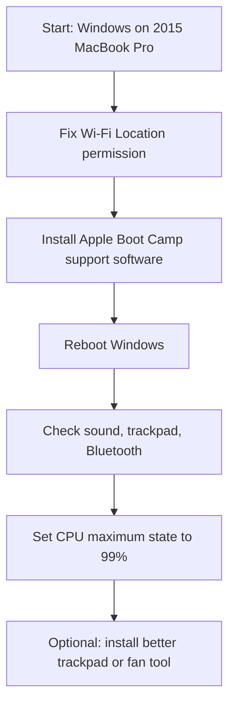

# Make a 2015 MacBook Pro Work Great on Windows 11

Simple fixes for Wi-Fi, sound, two-finger scroll, Bluetooth, fan noise, and missing Boot Camp drivers on a 2015 Retina MacBook Pro running Windows 10 or Windows 11.

This guide is written for normal people, not technicians. It avoids sketchy driver sites and does not include Apple driver files.

## Who This Helps

This is especially useful for:

- MacBook Pro Retina 15-inch 2015
- Model identifier: `MacBookPro11,4`
- Windows 10 or Windows 11 installed directly on the Mac
- Boot Camp drivers missing, broken, or only partly installed

It may also help nearby 2013-2015 Intel MacBook Pro models, but the exact driver package may differ.

## Common Symptoms

Use this guide if your MacBook has one or more of these problems in Windows:

- Wi-Fi adapter appears, but no Wi-Fi networks show up
- Windows says Wi-Fi scanning needs Location permission
- Two-finger scroll does not work
- Trackpad works only like a basic mouse
- Speakers do not work
- Sound device says `High Definition Audio Device`
- Fans ramp up loudly
- Bluetooth is missing or unreliable
- Device Manager shows unknown Apple devices
- Boot Camp Control Panel is missing

## Quick Fix Order

Follow the steps in this order.



## Step 1: Identify Your Mac

Press `Windows + R`, type:

```text
msinfo32
```

Look for **System Model**.

For the main tested machine, Windows showed:

```text
Apple Inc. MacBookPro11,4
```

If yours is different, the Wi-Fi fix may still apply, but use the correct Boot Camp support software for your Mac model.

## Step 2: Fix Wi-Fi Network Scanning

On newer Windows builds, Wi-Fi scanning can be blocked if Location access is turned off.

Open:

```text
Settings > Privacy & security > Location
```

Turn on:

- **Location services**
- **Let apps access your location**
- **Let desktop apps access your location**, if shown

Then reopen the Wi-Fi menu.

### Advanced Wi-Fi Fix

If the Location switch is stuck or Wi-Fi still cannot scan, open **Command Prompt as Administrator** and run:

```bat
reg add HKLM\SOFTWARE\Microsoft\Windows\CurrentVersion\CapabilityAccessManager\ConsentStore\location /v Value /t REG_SZ /d Allow /f
reg add HKCU\Software\Microsoft\Windows\CurrentVersion\CapabilityAccessManager\ConsentStore\location /v Value /t REG_SZ /d Allow /f
reg add HKCU\Software\Microsoft\Windows\CurrentVersion\CapabilityAccessManager\ConsentStore\location\NonPackaged /v Value /t REG_SZ /d Allow /f
```

Restart Windows after running the commands.

## Step 3: Install Apple Boot Camp Drivers

This is the most important step.

Without Boot Camp drivers, Windows may use generic drivers. Generic drivers can make the trackpad, sound, Bluetooth, keyboard keys, brightness, and fan behavior worse.

### Best Method

If you still have macOS available:

1. Boot into macOS.
2. Open **Boot Camp Assistant**.
3. Use **Action > Download Windows Support Software**.
4. Save the support software to a USB drive.
5. Boot back into Windows.
6. Open the USB drive.
7. Run:

```text
BootCamp\Setup.exe
```

8. Reboot when it finishes.

### If You Only Have Windows

You can use a tool called Brigadier to download Apple's Boot Camp support package for your Mac model.

Project:

```text
https://github.com/timsutton/brigadier
```

For this tested machine, the model was:

```text
MacBookPro11,4
```

After downloading the correct Windows support software, run:

```text
BootCamp\Setup.exe
```

Then reboot.

## Step 4: Check Sound

After Boot Camp is installed, sound should no longer show only as generic Microsoft audio.

Good signs:

```text
Cirrus Logic CS4208
Speakers (Cirrus Logic CS4208)
Internal Microphone (Cirrus Logic CS4208)
```

If sound still does not work:

1. Right-click the speaker icon.
2. Open **Sound settings**.
3. Choose **Speakers** as the output device.
4. Reboot once more.

## Step 5: Check Two-Finger Scroll

After Boot Camp is installed:

1. Open the small Boot Camp icon in the system tray.
2. Open **Boot Camp Control Panel**.
3. Go to the **Trackpad** tab.
4. Enable two-finger scrolling and tap-to-click options.

Good signs in Device Manager:

```text
Apple Multi-Touch
Apple Keyboard
Apple SPI Trackpad
```

## Step 6: Reduce Fan Noise

Older MacBooks can run hot in Windows because Windows uses CPU turbo boost aggressively.

A safe first fix is to set the maximum CPU state to `99%`.

Open **Command Prompt as Administrator** and run:

```bat
powercfg /setacvalueindex SCHEME_CURRENT SUB_PROCESSOR PROCTHROTTLEMAX 99
powercfg /setdcvalueindex SCHEME_CURRENT SUB_PROCESSOR PROCTHROTTLEMAX 99
powercfg /setactive SCHEME_CURRENT
```

This usually lowers heat and fan noise a lot.

If you want full performance later, set both values back to `100`.

## Step 7: Optional Better Trackpad Driver

For older non-T2 MacBooks, Apple may not provide Windows Precision Touchpad support.

Community option:

```text
https://github.com/imbushuo/mac-precision-touchpad
```

Try this only if the Apple Boot Camp trackpad driver works but still feels bad.

## Step 8: Optional Fan Control

If the fans are still too loud after Boot Camp drivers and the `99%` CPU setting, use a Boot Camp fan control tool.

Open-source option:

```text
https://github.com/bmats/fancontrol
```

Popular Boot Camp option:

```text
https://crystalidea.com/macs-fan-control
```

Use automatic or gentle temperature-based fan curves. Avoid forcing very low fan speeds.

## What Worked on the Tested Machine

Tested machine:

```text
MacBookPro11,4
Broadcom 802.11ac Wi-Fi
Cirrus Logic CS4208 audio
Intel Iris Pro Graphics 5200
Windows build 26200
```

Working fixes:

- Enabled Windows Location access to restore Wi-Fi scanning
- Installed Apple Boot Camp support software
- Restored Cirrus Logic speaker and microphone drivers
- Restored Apple Multi-Touch trackpad driver
- Restored Apple SMC, backlight, graphics mux, Bluetooth, and SMBus drivers
- Set CPU maximum state to `99%` to reduce fan ramp

## What This Repository Does Not Include

This repository does not include:

- Apple driver files
- Boot Camp installers
- Windows installers
- Repacked Apple software
- Modified Apple binaries

Use Apple's official Boot Camp support software or tools that download from Apple.

## Search Keywords

MacBook Pro 2015 Windows 11 Wi-Fi fix, Boot Camp drivers Windows 11, MacBookPro11,4 sound fix, MacBook Pro 2015 two finger scroll Windows, Broadcom 802.11ac Windows Location Wi-Fi scan, Cirrus Logic CS4208 Boot Camp, MacBook Pro fan noise Windows Boot Camp, Apple Multi-Touch Windows driver.

## Related Guides

- [Troubleshooting](docs/troubleshooting.md)
- [Safe Driver Sources](docs/safe-driver-sources.md)
- [Advanced Commands](docs/advanced-commands.md)
- [Publish This Guide to GitHub](docs/publish-to-github.md)

